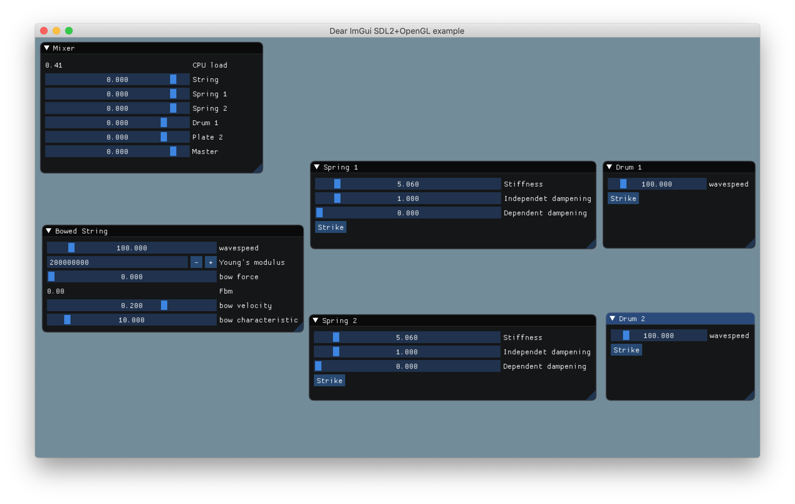

# Applied Physical Modeling: The Yaybahar

This repository contains the code of a C++ application that implements a physical
modeling sound synthesis algorithm that models the Yaybahar

The Yaybahar is a novel acoustical instrument created by Turkish artist Görkem Sen.
It consists of a string that is connected to two springs that connect to two drum
membranes. This produces a distinctive reverbarant sound.

The application should be quite easy to build on linux or macOS. If you do not
wish to build the application a sound example, [*example.mp3*](example.mp3), is provided.

## Building



The Yaybahar application is built using [pal](https://github.com/PelleJuul/pal),
a rapid prototyping C++ audio application framework.

First install the pal dependencies. On macOS, using homebrew, this can be done
with the command:

```
$ brew install sdl2 portaudio libsndfile
```
On linux try
```
$ sudo apt-get install sdl portaudio lib
```

Then build the application using make.

```
$ make
```

And run the application.
```
$ ./yaybahar
```

On linux you probably have to change the OpenGL build flag. In *makefile* exchange
```
LIBS=-lsdl2 -lportaudio -lsndfile -framework OpenGl
```
for
```
LIBS=-lsdl2 -lportaudio -lsndfile -lGL
```

You're welcome to create an issue on GitHub is you have issues running the code.

## License

The Yaybahar application is free to use for educational purposes under the conditions
specified in [*license.md*](license.md). For commercial or other purposes please get in touch.